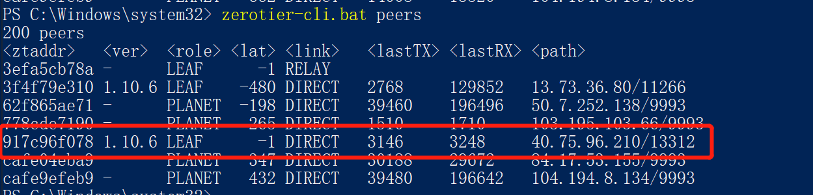
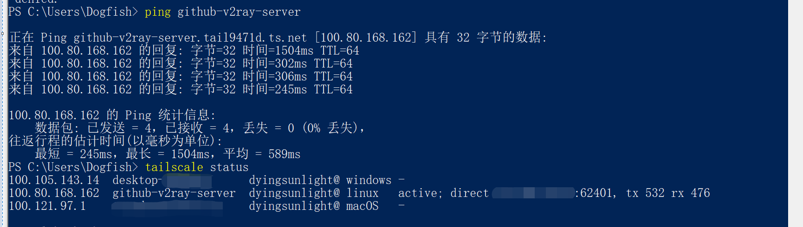

# Free Rider
利用 GitHub Actions 免费做各种事情。

### 警告
***注意，本项目仅从技术层面进行探讨各种可能实现方案从而帮助理解网络原理，请勿用于实际操作。***   
***注意，Github 使用条款中明确声明 Github 可以无理由封禁任何账户。***

# 使用 GitHub Actions 科学上网
由于外界不能直接访问 GitHub Actions 任务运行时，因此核心理念是组建
[虚拟局域网（VLAN）](https://zh.wikipedia.org/wiki/%E8%99%9A%E6%8B%9F%E5%B1%80%E5%9F%9F%E7%BD%91)
实现相互的访问，可用选择的工具有：
- [ZeroTie](https://www.zerotier.com)
- [Tailscale](https://tailscale.com)

尽管这两家的用例都会给出，但只推荐使用 `ZeroTier`， `Tailscale` 只能使用设备别名而不能使用固定的 IP 地址，并且设备别名同步有延迟，
这使得客户端无法及时的知道服务器可能已经发生变动，导致网络中断。

## 开始使用 
以 ZeroTie 为例，出于安全方面考虑，你需要自行创建和注册账户，并且指定自己的配置文件。

### ZeroTie
1. [安装 ZeroTier 客户端](https://www.zerotier.com/download/)
2. 登录 [ZeroTier](https://my.zerotier.com/) 账户，并且选择 `Create A Network` 创建网络，并且记录 `ZeroTier Netowrk Id`
3. 打开 [账户页面](https://my.zerotier.com/account) 后，点击 `New Token` 创建一个 ZeroTier `API Access Tokens` 
4. 打开 fork 后的 github setting，点击 `Actions secrets and variables`，创建 `New repository secret`，将上述 3、4 步骤取得的两个值填入
   - 新建 `ZEROTIER_NETWORK_ID`，值为 `ZeroTier Netowrk Id`
   - 新建 `ZEROTIER_TOKEN`，值为 `API Access Tokens` 
   - 新建 `V2RAY_CONFIG_JSON`, 值为你的服务端配置（[参考](v2ray.template.json)，替换 `$UUID$` 即可）
5. 推荐 fork 此项目后 clone 到本地进行修改（或者是下载 [Workflows 模板](.github/workflows/zerotier+v2ray.yaml) 到本地，然后自行创建项目上传）
6. 编辑 `.github/workflows/zerotier+v2ray.yaml` 的 [Workflows 模板](.github/workflows/zerotier+v2ray.yaml)，
   - 修改模板，设定 `cron` 计划任务和 `timeout-minutes`
   - 可选，可以额外指定 `IP_ASSIGNMENT`，请注意这是服务器的地址
7. 提交 `zerotier+v2ray.yaml` workflows 文件，检查运行状态是否正常（简单的 ping `IP_ASSIGNMENT` 检查响应结果）
8. 打开 `ZeroTier` 桌面端
9. 配置客户端 clash 文件，这是一个 [简单的模板](clash.template.yaml)，需要填入之前的 `$UUID$`，如果服务器地址有修改那么对于的 `server` 字段也应该使用。
 
### Tailscale
Tailscale 的使用和 ZeroTier 几乎是相同的，唯一的区别是 Tailscale 使用 `Auth Key` 来加入网络，因此你需要在[这里生成](https://login.tailscale.com/admin/settings/keys) `AuthKey` 并且勾选 Reusable，
并且最终添加到项目的 `Actions secrets and variables` 
  - 新建 `TAILSCALE_TOKEN`，值为  `AuthKey`

Tailscale 的模板文件[在这里](.github/workflows/tailscale+v2ray.yaml)

### 效果
从连接效果上来看，无论和 ZeroTier 或者是 Tailscale 都能实现打洞直连不使用 relay 中转，实际网络性能测试可以达到 `250ms`/`50Mbps` 的水准，但延迟波动不稳定。

遗憾的是，这个方法是无法在移动端使用。尽管 zerotier 和 tailscale 有提供 App 客户端，但是它们运行时需要占用 VPN 功能来实现组网，不能和梯子客户端同时启用。

### 未完待续
